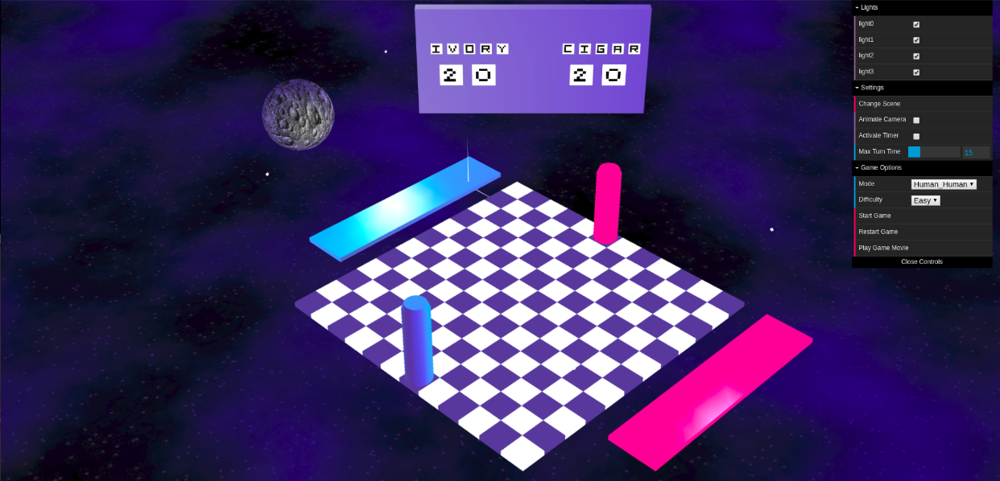
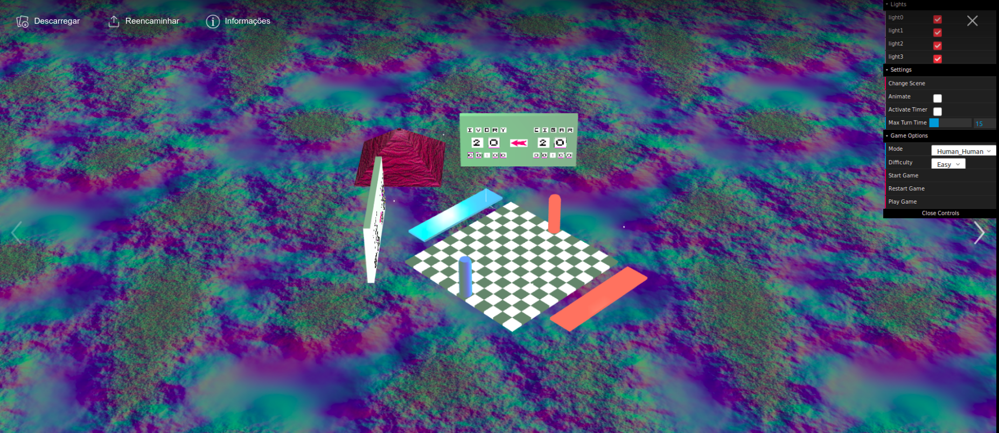

<h3 align="center" style="margin: 0 auto">Monkey Queen<!-- Serve Confidently --></h3>

Implementation of the board game Money Queen for a Computer Graphics class

---

1. Instructions to install: 

  - download TP3 folder
  - start running the prolog server.pl in Sicstus
  - start running a local server
  - open index.html
  
2. Game Rules:

  You can find the rules to play the game and explanation of the prolog implemantation of the game [here](https://github.com/margaridaviterbo/LAIG/blob/master/Tp3/docs/PLOG_TP1_FINAL_Monkey_Queen_2.pdf)
  
3. Some views of the game:

  
  
  
  
  
  
